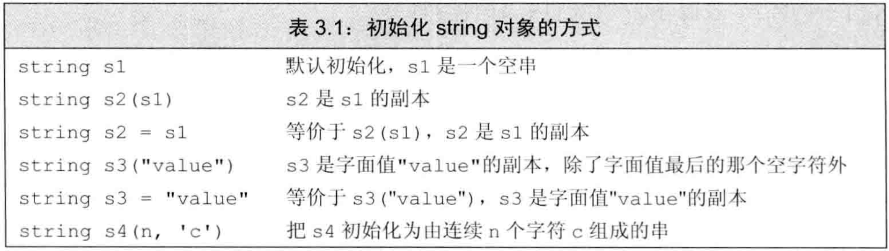
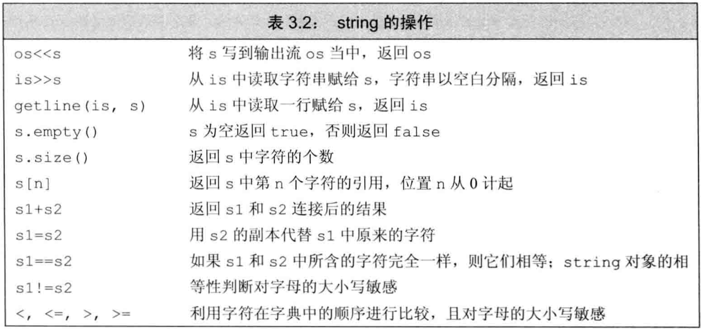
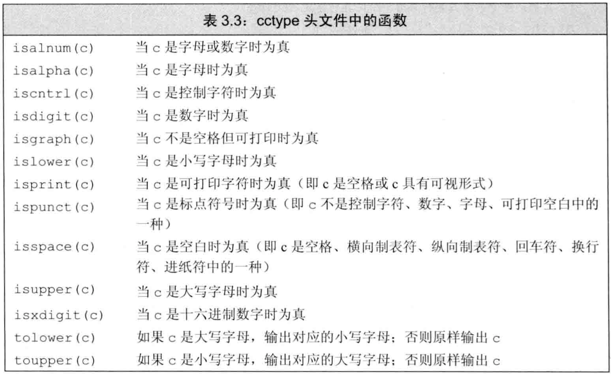
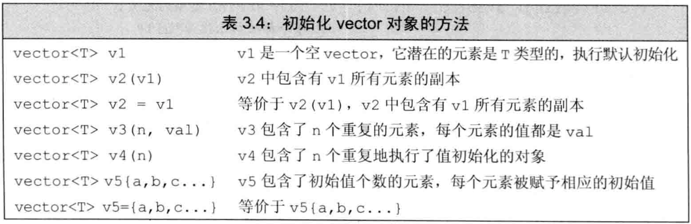
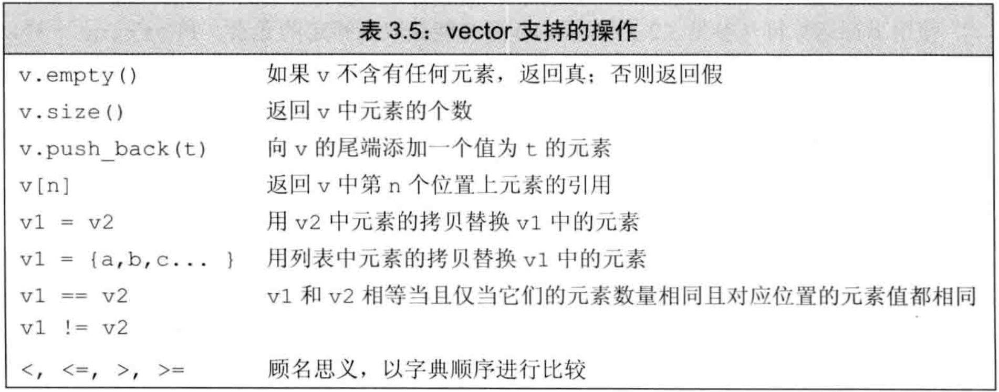
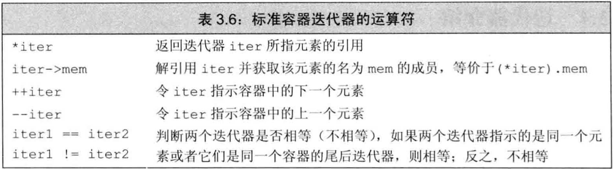
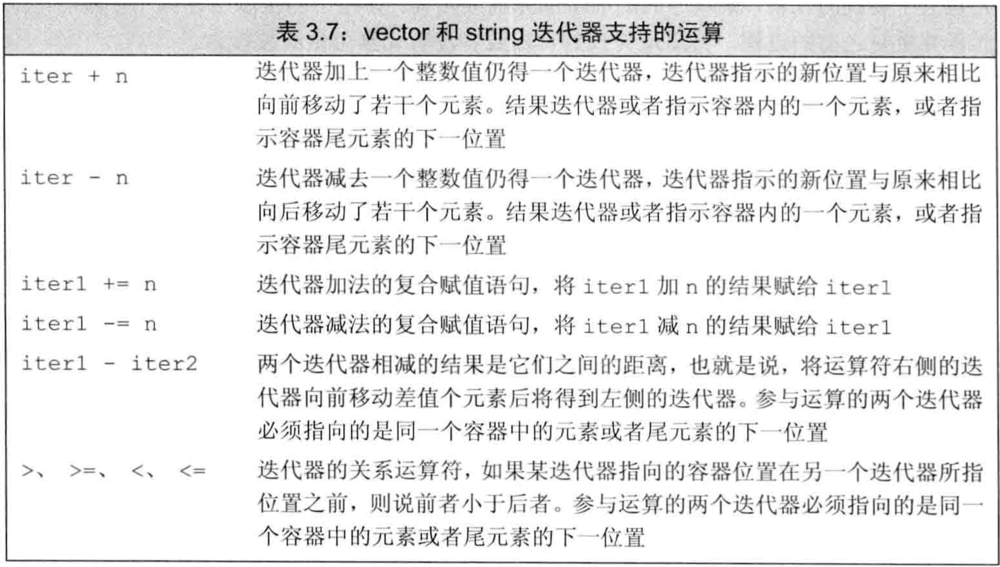
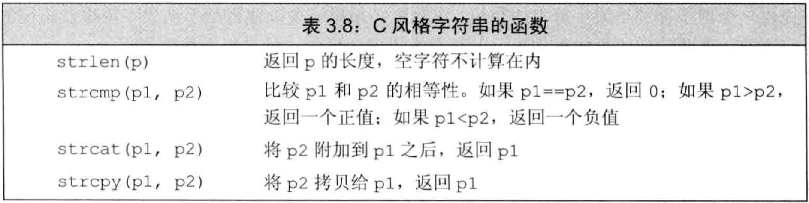

# C++ primer 第3章 字符串、向量和数组

## 文章目录

[toc]

-   `string`和`vector`是两类最重要的标准库类型，`strng`表示可变长的字符序列，`vector`存放某种给定类型对象的可变长序列。
-   `迭代器`是string和vector的配套类型，常被用于访问string的字符或vector的元素。
-   `内置数组`是更基础的类型，string和vector都是对它的抽象。
-   `内置类型`是由C++语言直接定义的，体现了大多数计算机硬件本身具备的能力。`标准库`定义了另一组具有更高级性质的类型。

## 命名空间的using声明

-   `域操作符::`：编译器从操作符左侧名字所示的作用域中寻找右侧的名字。
-   使用`using声明`就不需要每次指定命名空间就能使用一个名字，形如`using namespace::name;`，这样以后可直接使用`name`。
-   每个`using`引入一个名字，因此每个名字都必须有自己的using
-   由于头文件的代码会被拷贝到引用它的文件中，故头文件的代码不应使用using

## 标准库类型string

-   `string`是标准库类型，表示可变长字符序列，定义在头文件`string`和命名空间`std`中。

### 定义和初始化string对象

-   如何初始化类的对象是由类本身定义。
-   例子：string的初始化
```cpp
string s1;          //默认初始化，为空字符串
string s2(s1);      //直接初始化，s2是s1的副本
string s2=s1;       //拷贝初始化，s2是s1的副本，等价于上一行
string s3("hiya");  //直接初始化，初始化为字面值常量
string s3="hiya";   //拷贝初始化，初始化为字面值常量，等价于上一行
string s4(10,'c');  //直接初始化，初始化为10个字符'c'
```


-   `直接初始化`：不用等号，而用括号初始化变量。调用构造函数
-   `拷贝初始化`：用等号初始化变量。调用重载的赋值运算符
-   可以先用`直接初始化`构造`临时量`，然后`拷贝初始化`：`string s=string(10,'c');`

### string对象上的操作

-   类既能定义通过函数名调用的操作（`成员函数`），又能定义`<<`、`+`等各种运算符在该类对象上的新含义（`重载运算符`）。下表列举string对象可进行的大多数操作： 
-   从iostream中读取string：用`>>`读取时，string对象忽略开头的空白（包括空格、换行、制表符等），从第一个真正的字符读起，直到下一处空白为止。
-   string对象的`<<`和`>>`也是返回运算符左侧的iostream对象。
-   如要在iostream中读取时保留空白，需用`getline函数`，该函数从iostream中读取内容，直到遇到换行（换行也被读入），然后把读到的内容存入string对象（不存换行符）。
-   getline也返回它的iostream，故也可作为while的条件。
-   `empty函数`根据string对象是否为空返回一个bool
-   `size函数`返回string对象的长度（字符数）
-   size函数返回的类型是`string::size_type`（可用decltype得到），它是`无符号`类型，且能放下任何string对象的大小。（attention：不能将size与int等有符号类型混合计算）
-   `==`和`!=`验证两字符串内容是否完全相同，`<`、`<=`、`>`、`>=`比较两字符串的`字典顺序`（大小写敏感）
-   用`=`进行string对象的拷贝和赋值
-   用`+`拼接两string对象，也可拼接一个string对象和一个字符串字面值（类型转换），但不能拼接两个字符串字面值。因为`string和字符串字面值是不同的类型`

### 处理string对象中的字符

-   在`cctype头文件`中定义了一组函数用于处理字符，如下表： 
-   C++标准库兼容了C标准库，C中命名为`name.h`的头文件，在C++中被命名为`cname`，它们内容一样，但`cname`中的名字属于命名空间`std`，`name.h`中的名字不属于任何命名空间。（所以最好不要用C标准库）
-   `范围for语句`：用`for(declaration:expression)`遍历给定序列的每个元素。其中`expression`是一个序列，`declaration`定义一个变量，用于访问序列中的元素，常用auto。
-   使用范围for时，如果要改变序列中元素的值，必须把循环变量定义为`引用`类型。
-   例子：范围for中改变元素

```cpp
string s("hello,world!");
for(auto &c:s)  //要改变序列中的元素，必须声明为引用类型
    c=toupper(c);
cout<<s<<endl;
```

-   访问string对象中的单个字符有两种方式：`下标`和`迭代器`
-   `下标运算符[]`接受`string::size_type`（unsigned）类型的值，返回该位置上字符的`引用`（因此可修改字符）。若给索引提供signed值，会转为string::size_type表示的unsigned
-   例子：用下标迭代
```cpp
for(decltype(s.size()) index=0;             //用decltype推出string::size_type类型
    index!=s.size() && !isspace(s[index]);  //逻辑与，只有左侧为真时才检查右侧。故能保证下标合理时才访问
    ++index)
{s[index]=toupper(s[index]);}
```

## 标准库类型vector

-   `vector`表示对象的集合，所有对象的类型都相同。
-   由于vector容纳着其他对象，故称为`容器`
-   vector是一个类模板。C++中有`类模板`和`函数模板`。模板本身不是类或函数，可将模板看作为编译器生成类或函数的一份说明。编译器根据模板创建类或函数的过程称为`实例化`
-   由模板生成类或函数时，必须指定类型
-   在C++11之前，元素为vector的vector对象，模板变量里必须有空格
-   例子：根据模板vector声明对象
```cpp
vector<int> ivec;               //元素是int型对象
vector<Sales_item> Sales_vec;   //元素是Sales_item类型的对象
vector<vector<string>> file;    //元素是vector<string>类型的对象
vector<vector<string> > file;   //C++11之前的写法，元素是vector<string>类型的对象
```

### 定义和初始化vector对象



-   vector的初始化方法有直接初始化、拷贝初始化、列表初始化
-   通常创建vector对象的方法是：先默认初始化得到一个空vector，再向其中添加元素
-   `列表初始化`：用花括号`{}`括起来的0个或多个元素赋值给vector对象。
-   `值初始化`：可以只提供vector的元素数量而不提供初始值。此时元素都会被值初始化。如果元素是内置类型，会被置为0，如果元素是类类型，由类默认初始化（有些类不支持默认初始化，这时vector也无法初始化）。
-   初始化的真实含义依赖于传参时用圆括号还是花括号。圆括号是构造，花括号是列表初始化。但当花括号无法初始化时，会尝试将花括号代替为圆括号。
-   例子：vector构造和列表初始化
```cpp
vector<int> v1(10);         //有10个元素，都是0
vector<int> v2{10};         //有1个元素，值是10
vector<int> v3(10,1);       //有10个元素，都是1
vector<int> v4{10,1};       //有2个元素，分别是10和1
vector<string> v5{"hi"};    //有1个元素，是字符串"hi"
vector<string> v6("hi");    //错，不能用字符串字面值构造vector
vector<string> v7{10};      //不能列表初始化，转为构造。有10个元素，都是空字符串
vector<string> v8{10,"hi"}; //不能列表初始化，转为构造。有10个元素，都是"hi"
```

### 向vector对象中添加元素

-   `push_back函数`：把一个对象当vector的尾元素压入vector尾端
-   实际上，建立空对象再向其中push_back非常高效，比创建时确定大小之后再修改的方式更快。
-   `范围for循环体内不应该改变其遍历序列的大小`。

### 其他vector操作

[](https://canpi.cc/post/cpp/cpp_figs/CPPprimer_ch3-tab_3_5.png)

-   vector的`size方法`返回该vector的元素数量，类型是`vector<type>::size_type`类型。使用size_type时，需首先指定是哪种类型的size_type。
-   只有元素类型可比较时才能将vector按字典顺序比较。
-   对vector索引时，下标类型是相应的size_type类型
-   不能用下标添加元素，用下标访问不存在的元素会引发错误（编译不报错），例如`缓冲区溢出`等
-   确保访问元素有效的方法之一是使用`范围for`

## 迭代器介绍

-   `迭代器`比下标访问更通用。所有标准库容器都支持迭代器，但只有几种支持下标。
-   string对象不属于容器，但操作上和容器很接近
-   迭代器提供了对元素对象的`间接访问`，类似于指针。其对象是容器中的元素，或string中的字符
-   `有效`的迭代器或者指向某个元素，或者指向尾元素的下一位置，其他都是无效。

### 使用迭代器

-   有迭代器的类型都配套有返回迭代器的成员。其中`begin方法`返回指向首元素的迭代器，`end方法`返回指向尾元素的下一位置（尾后）的迭代器。空容器的begin()和end()返回同一迭代器。
-   从函数中返回迭代器时，类型用`auto`，不用管迭代器的类型。 [](https://canpi.cc/post/cpp/cpp_figs/CPPprimer_ch3-tab_3_6.png)
-   可用`解引用符*`访问迭代器指向的元素，类似指针。试图解引用无效或尾后迭代器都是未定义。
-   对迭代器使用`++`可移动到下一个元素，它们是逻辑上先后的关系，空间上不一定相邻。
-   用`++`、`--`、`==`、`!=`来进行遍历操作，因为这些操作在所有容器的迭代器上都有效。而索引和`<`、`>`等操作符在大多数容器的迭代器中未定义。
-   迭代器的类型是相应容器类型的`iterator`和`const_iterator`，前者可读可写，后者只能读。类型书写如`vector<int>::iterator`。每个容器都定义了一个名为iterator的类型。
-   如果容器内对象为常量，则`begin`和`end`返回`const_iterator`迭代器，否则返回`iterator`迭代器
-   `cbegin方法`和`cend方法`对任何容器都返回`const_iterator`迭代器
-   通过迭代器调用元素对象的成员时，使用诸如`(*it).function()`，括号必不可少，不然`it`先取成员再解引用。
-   通过迭代器调用元素对象的成员时，亦可使用简化的`->操作符`，它将解引用和取成员两个操作结合，`it->function()`等价于`(*it).function()`
-   任何可能改变容器容量的操作，如`push_back`，都会使容器的迭代器失效。

### 迭代器运算

-   `string`和`vector`是顺序存储，故它们的迭代器支持更多的操作，如`迭代器运算`，这些操作可使迭代器每次移动跨越多个元素，也可对迭代器比较大小。 
-   可使迭代器和整数值相加减，返回值是向前或向后移动若干位置的迭代器。
-   可使用关系运算符`>`、`>=`、`<`、`<=`对迭代器比较大小
-   将迭代器相减，结果是两迭代器的`距离`，指的是右侧迭代器向前移动多少位置能和左侧迭代器重合，距离可正可负。其类型是容器类型对应的`difference_type`，是`signed`的整型数。

## 数组

-   `数组`也是存放类型相同的对象的容器，这些对象本身没有名字，通过在数组中的位置访问。
-   数组大小确定不变，不能增加元素。性能比vector等容器更好。

### 定义和初始化内置数组

-   数组是一种`复合类型`，声明形如`int a[d];`，其中`a`是数组名，`d`是数组大小。`数组大小也是类型的一部分`，在编译时应该已知，必须是`常量表达式`。
-   默认情况下，数组元素被默认初始化
-   定义数组时应手动写出类型，不可用auto，但可用decltype
-   可对数组做列表初始化，此时不用手动指定大小，列表长度就是数组大小。如果手动指定大小，大小只能大于或等于初值列表大小，用初值列表初始化靠前元素，其后的默认初始化。
-   字符数组比较特殊，可用字符串字面值初始化，且不需手动指定大小，此时会在最后加上空字符。
-   例子：字符数组初始化
```cpp
char a1[]={'C','+','+'};        //列表初始化，无空字符
char a1[]={'C','+','+','\0'};   //列表初始化，有空字符
char a3[]="C++";                //字符串字面值初始化，有空字符
const char a4[6]="Daniel";      //错，没有空间放空字符了
```

-   不能将数组拷贝给其他数组作为初值，也不能用数组为数组赋值。因为数组名是首元素地址，不能代表整个数组。有些`编译器扩展`可能支持数组的拷贝，尽量不使用。
-   解读带数组的声名符：从内向外，从右向左
-   例子：`指针数组`、`数组指针`、`数组引用`的声明
```cpp
int arr[10];
int *ptrs[10];          //指针的数组。是长度为10的数组，元素是指针，指向int型
int &refs[10]=/*?*/     //错，引用不是对象，不存在引用的数组
int (*Parray)[10]=&arr; //数组的指针。是指针，指向长度为10的数组，元素是int型
int (&arrRef)[10]=arr;  //数组的引用。是引用，引用长度为10的数组，元素是int型
int *(&arry)[10]=ptrs;  //指针数组的引用。是引用，引用长度为10的数组，元素是指针，指向int型
```
### 访问数组元素

-   数组元素可用范围for或下标访问
-   使用数组下标时，将其定义为`size_t`型，它是一种机器相关的unsigned类型，它足够大以表示内存中任意对象的大小，定义于`cstddef头文件`中。
-   数组的下标类型由C++语言定义，vector等容器的下标类型由标准库定义。

### 指针和数组

-   使用数组名的时候，编译器一般会将其转换为指向首元素的指针。
-   对数组元素用`取地址符&`能手动得到其指针
-   当数组名作为`auto`变量初值时，推出的类型是指针而非数组，效果相当于对首元素取地址再给初值。但用`decltype`时，得到的是数组类型。
-   指针也是迭代器，string和vector的迭代器支持的运算都可被数组指针支持。
-   用`begin`和`end`得到数组的首元素指针和尾后指针，这两个函数定义于`iterator头文件`中。由于数组不是类，故它们也不是成员方法
-   两指针相减的结果类型是`ptrdiff_t`，定义于`cstddef头文件`，是一种signed类型。
-   指针运算与下标：表达式`*(ia+4)`计算指针`ia`前进4个元素后的新地址并解引用，等价于`ia[4]`
-   指针可使用下标。实际上，`对数组使用下标，其实是对首元素指针使用下标`。此时编译器将数组名转为首元素指针，再对指针使用下标。
-   标准库内的迭代器下标必须为unsigned，但指针的下标是C++内置，可以处理负值，即`指针可接受signed下标`

### C风格字符串

-   `C风格字符串`不是一种类型，而是为了表达和使用字符串而形成的一种约定俗成的写法。按此习惯书写的字符串存在字符数组中且以空字符结束。一般用`字符指针`操作它们。
-   一些操作C风格字符串的函数被定义在`cstring头文件`中，传入这些函数的是字符指针，必须指向以空字符作为结束的数组。对这些函数而言，空字符是字符串结束的标志。 
-   由于C风格字符串是字符指针，故：
    -   用`==`比较string对象，但只能用`strcmp函数`比较C风格字符串
    -   用`+`拼接string对象，但只能用`strcat函数`拼接C风格字符串
    -   用`=`拷贝string对象，但只能用`strcpy函数`拼接C风格字符串
-   对于strcat和strcpy，需提供存放结果的空间，并由程序员确保此空间不会溢出。
-   用标准库的string对象比C风格字符串更安全

### 与旧代码的接口

-   任何可出现字符串字面值的地方都可用C风格字符串（空字符结束的字符数组）替代，例如构造string、使用string的运算符时
-   如果程序需要C风格字符串，不能直接用string对象代替。应该用string对象的`c_str方法`返回它对应的C风格字符串，且指针类型是`const char *`，保证不会改变string的内容。
-   不允许用数组初始化另一个数组，不允许用vector对象初始化数组，但允许用数组初始化vector对象。更进一步，可以用一对迭代器初始化vector对象。
-   例子：用数组的一对迭代器初始化vector对象
```cpp
int int_arr={0,1,2,3,4,5};
vector<int> ivec(begin(int_arr),end(int_arr)); //用数组的一对迭代器初始化vector对象
```

-   尽量用vector和迭代器，不要用数组和指针
-   尽量用string，不要用C风格字符串

## 多维数组

-   C++语言并无多维数组，`多维数组是数组的数组`。
-   对于`二维数组`而言，第一个维度为`行`，第二个维度为`列`
-   可对数组用列表初始化，花括号可嵌套也可不嵌套。因为`数组连续存储`
-   例子：多维数组的定义、绑定一行
```cpp
int ia[3][4]={0,1,2,3,4,5,6,7}; //ia是3元素数组，每个元素是4元素数组，ia三行四列。将前两行初始化，第三行默认初始化
int ib[3][4]={{0},{4},{8}};     //ib是3元素数组，每个元素是4元素数组，ia三行四列。将第一列初始化，其余元素默认初始化
int (&row)[4]=ia[1]             //row是引用，引用一个4元素数组，其元素类型为int，被初始化为ia的第二行
```

-   如果要用`范围for`和`auto`处理多维数组，除了最内层循环，其他所有循环的auto类型都应该是引用。
-   例子：范围for语句处理多维数组
```cpp
// 修改元素
size_t cnt=0;
for(auto &row:ia){      //遍历行，外层循环声明为引用的原因是避免数组被auto为指针
    for(auto &col:row){ //遍历列，内层循环声明为引用的原因是要修改元素
        col=cnt;        //修改元素
        ++cnt;
    }
}
// 打印元素
for(const auto &row:ia) //避免数组被auto为指针
    for(auto col:row)   //最内层循环是元素不是数组，不存在被auto为指针的问题
        cout<<col<<endl;
// 错误例子
for(auto row:ia)        //ia被auto为指针类型
    for(auto col:row)   //错，指针不可遍历
```