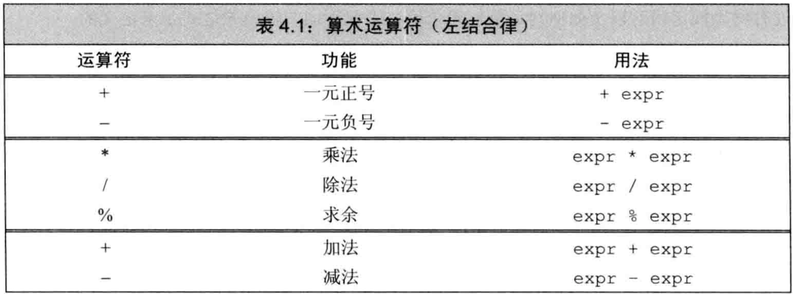
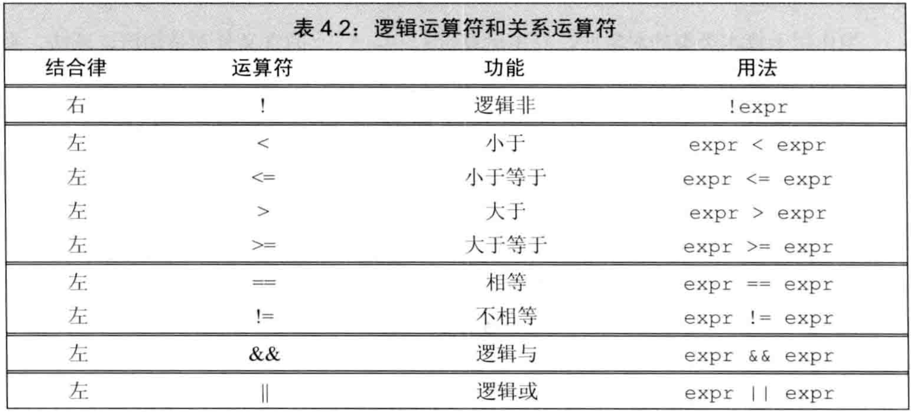
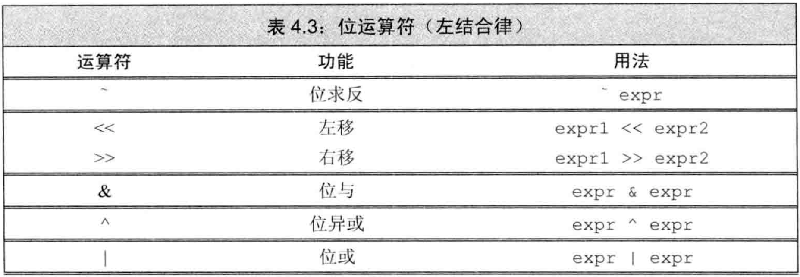
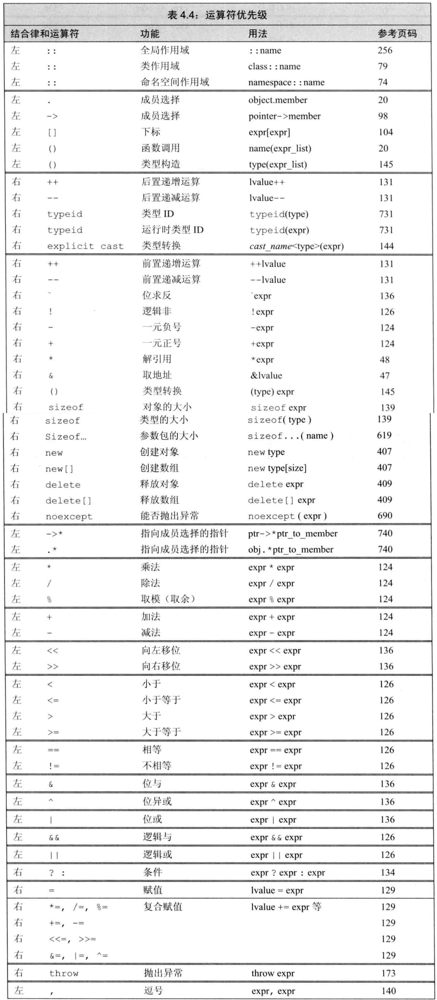

# C++ primer 第4章 表达式

## 文章目录

[toc]

-   C++提供了一套`运算符`并定义了它们作用于`内置类型`时的操作
-   运算对象是类类型时，允许`重载`运算符
-   `表达式`由一个或多个`运算对象`组成，对表达式求值返回`结果`。把`运算符`和`运算对象`组合可得到复杂表达式。

## 基础

### 基本概念

-   `一元运算符`作用于一个对象，`二元运算符`作用于两个对象，还有`三元运算符?:`。`函数调用`也是特殊的运算符，其运算对象数量没有限制。
-   一个符号是什么运算符由上下文指定，如`*`
-   理解表达式的含义，首先要知道运算符的`优先级`、`结合律`，以及运算对象的`求值顺序`。
-   运算符中经常进行`类型转换`，常见的是`整型提升`，如小整型（bool、char、short）被提升为int
-   `重载运算符`：为已存在的运算符赋予另外的操作。其中，运算对象和返回值的类型、操作方式都可重载，运算对象的个数、运算符的优先级和结合律不可重载。
-   C++的表达式都是右值或左值。它们的含义不仅仅是能不能位于赋值语句的左侧（反例如const等）。
-   `当对象被用作右值时，用的是对象的值（内容）。当对象被用作左值时，用的是对象的身份（在内存中的位置）。`
-   除右值引用外，需要右值的地方都能用左值代替，反之不可。当左值被作为右值使用时，用的是它的值。
-   运算符的左右值要求：
    -   赋值符`=`需要非常量左值作为左侧对象，返回结果也是左值
    -   取地址符`&`作用于左值对象，返回指向该对象的指针，该指针是右值
    -   内置解引用`*`、内置下标`[]`、迭代器解引用`*`、string和vector的下标`[]`，它们返回的结果都是左值
    -   内置和迭代器的递增`++`递减`--`作用于左值对象，其前置版本返回左值
-   若表达式求值结果是左值，则decltype的结果是引用类型。例如`int *p;`求`decltype(*p)`的结果是`int &`

### 优先级与结合律

-   `复合表达式`是含有两个或多个运算符的表达式
-   `优先级`和`结合律`决定了运算对象的组合方式。先看优先级，一致时看结合律
-   括号`()`无视优先级和结合律
-   算术运算符和IO运算符都满足`左结合律`

### 求值顺序

-   `求值顺序`定义了多个运算对象哪个先被求值，如`f1()*f2()`中哪个函数先被调用
-   对于未指定求值顺序的运算符，若表达式指向并修改了同一个对象，则行为未定义。如`cout<<i<<i++;`
-   明确规定求值顺序的4种运算符：逻辑与`&&`、逻辑或`||`、条件`?:`、逗号`,`
-   最佳实践：
    -   拿不准优先级和结合律时，用括号。
    -   若表达式某处改变了某对象的值，则其他地方不要使用它。例外：`*++iter`

## 算术运算符



-   如上表是算术运算符，其中一元运算符优先级最高，其次乘除和求余，最后加减。

-   算术运算符都满足`左结合律`

-   算术运算符的运算对象和结果都是`右值`。

-   算术表达式求值前，小整型都会被提升。所有对象最终都转换成同一种类型

-   一元正号、加减都可用于指针。一元正号作用于指针或算术值时，返回（提升后的）`副本`，一元负号对对象的值取负后，返回（提升后的）`副本`。

-   算术运算符的结果可能`溢出`，其结果与机器相关，不可预知

-   参与取余`%`的运算对象必须都是整型，不可用浮点做转换

-   除法运算`/`中，C++的早期版本允许结果为负时向上或向下取整，C++11之后规定`商一律向0取整`，即直接切除小数部分。

-   取余运算`%`中，若`m`和`n`是整数且`n`非0，则表达式`(m/n)*n+m%n`的结果为`m`。即，若`m%n`不为0，则其符号与`m`相同。C++的早期版本允许`m%n`的符号匹配`n`的符号且商向负无穷侧取整，但在C++11中被禁止了。除了`-m`导致溢出的特殊情况，`(-m)/n`和`m/(-n)`都等于`-(m/n)`，`m%(-n)`等于`m%n`，`(-m)%n`等于`-(m%n)`

-   例子：负数的除法和取余

    ```cpp
    21%6;   /*结果是3*/     21/6;   /*结果是3*/
    21%7;   /*结果是0*/     21/7;   /*结果是3*/
    -21%-8; /*结果是-5*/    -21/-8; /*结果是2*/
    21%-5;  /*结果是1*/     21/-5;  /*结果是-4*/
    ```

## 逻辑和关系运算符



-   关系运算符作用于算术或指针类型，逻辑运算符作用于任何能转换为bool的类型。它们的返回类型都是bool型`右值`。

-   逻辑与`&&`、逻辑或`||`都是`短路求值`，先求左侧，仅由左侧无法确定表达式结果时再求右侧。

    -   逻辑与`&&`仅当左侧为`真`时才求右侧
    -   逻辑或`||`仅当左侧为`假`时才求右侧

-   使用中，可由逻辑与或的短路求值特性保证访问安全，例如`index!=s.size() && !isspace(s[index])`

-   访问大对象时尽量用引用，避免发生拷贝

-   逻辑与或都满足左结合律，逻辑非满足右结合律。

-   关系运算符都满足左结合律，因此不能出现`i<j<k`这种写法。

-   进行比较时除非比较对象都是严格的bool类型， 否则不要用`==true`等字面值，因为true提升为整型时是1，不是任何非零值都能`==true`

## 赋值运算符

-   赋值运算符的左侧对象必须是可修改的`左值`，其返回结果就是左侧对象，也是`左值`。
-   如果左右类型不匹配，将右侧转为左侧类型。
-   类类型的赋值运算符由类本身决定，如vector模板`重载`了赋值运算符使其可接收花括号列表作为初值。
-   无论左侧对象的类型是什么，初始值列表都可为空。此时编译器创建一个值初始化的`临时量`来初始化。
-   赋值运算满足`右结合律`，即多重赋值语句`a=b=c;`解读为`a=(b=c);`，前面所有类型或者和最右侧类型相同，或者可由最右侧类型转换得到。
-   C++允许赋值运算的结果作为条件，所以`=`和`==`要分清。
-   复合赋值运算符：
    -   算术运算符： `+=` `-=` `*=` `/=` `%=`
    -   位运算符： `<<=` `>>=` `&=` `|=` `^=`
-   复合运算符更快：复合运算符`a+=b`仅求值一次，普通运算符`a=a+b`求值两次，一次加法一次赋值。

## 递增和递减运算符

-   由于很多`迭代器`不支持算术运算，故`++`和`--`的存在有其意义。

-   递增和递减符都作用于`左值`对象。

-   `++i`被称为`前置版本`，`i++`被称为`后置版本`。

-   `前置版本和后置版本的区别`：

    -   前置版本将对象+1或-1后，将对象`本身`作为`左值`返回
    -   后置版本将对象+1或-1后，将对象`原始值`的`副本`作为`右值`返回

-   应尽量使用前置版本，因为比后置版本少一次拷贝，避免了不必要的工作。

-   混用解引用和递增可实现简洁性：`cout<<*iter++;`等价于`cout<<*iter; ++iter;`

-   由于求值顺序经常未指定，所以不要在一条语句中出现`a`和`a++`，如`*beg=toupper(*beg++);`未定义，可被解读为`*beg=toupper(*beg)`或`*(beg+1)=toupper(*beg)`

## 成员访问运算符

-   点运算符`.`获取类对象的一个成员，箭头运算符`->`由解引用`*`和点运算符`.`组成，即`ptr->mem`等价于`(*ptr).mem`，括号不可省略，因为点优先级比解引用高。
-   箭头运算符作用于指针，得到对象的成员，结果是`左值`。（因为解引用得到的一定是引用，引用是左值）
-   点运算符取决于对象：对象是左值就返回左值，对象是右值就返回右值。

## 条件运算符

-   条件运算符`?:`允许把简单的if-else逻辑嵌入单个表达式。用法如`cond?expr1:expr2`
-   条件运算符定义了求值顺序，类似于短路求值，根据`cond`的结果来决定执行`expr1`还是`expr2`，只会执行一个。
-   如果`expr1`和`expr2`都是左值或能转换为同一种左值类型，则运算结果是左值。否则是右值。
-   条件运算符满足`右结合律`，即`a?b:c?d:e`应解读为`a?b:(c?d:e)`

## 位运算符

-   位运算符作用于`整型`对象。另外，一种名为`bitset`的标准库类型也可表示任意大小的二进制位集合，位运算符也可作用于`bitset`对象。 
-   位运算符遇到小整型（如bool、char、short等），会先将其自动提升再运算。
-   如果位运算符的运算对象是signed且值为负，则处理符号位的方式取决于机器。左移右移会改变符号位，是未定义行为。
-   移位运算符`<<`和`>>`：首先令左侧运算对象按照右侧运算对象的要求移动指定位数，然后将移动后的（可能被提升了）左侧对象的`拷贝`作为结果。其中右侧对象一定不能为负，且值必须严格小于左侧位数。移出边界的位被舍弃。
-   移位运算符满足`左结合律`
-   左移运算符向右侧插入0，右移运算符向左侧插入的数值取决于类型和机器：unsigned类型插入0，signed类型取决于机器和编码方式。
-   例子：移位和整型提升

-   对char等小整型按位取反`~`也会先提升为int大小再取反。

    ```cpp
    unsigned char bits=0233;    //10011011
    bits<<8;    //提升为int大小，再左移8位，00000000 00000000 10011011 00000000
    bits<<31;   //提升为int大小，再左移31位，10000000 00000000 00000000 00000000
    bits>>3;    //提升为int大小，再右移3位，00000000 00000000 00000000 00010011
    ```

## sizeof运算符

-   sizeof运算符返回一条`表达式`或一个`类型`所占的`字节数`，满足`右结合律`，返回值是`size_t`类型的`常量表达式`。
-   两种形式：`sizeof(type)`、`sizeof expr`
-   sizeof不会计算运算对象的值，所以可以：
    -   可在sizeof里解引用无效指针，因为不会真的解引用。
    -   可在sizeof里用域操作符`::`获取类成员大小，而不需要对象和成员。
-   sizeof的结果取决于运算对象的类型：
    -   char型表达式返回1
    -   引用做sizeof返回被`引用对象`所占空间大小
    -   指针做sizeof返回`指针本身`所占空间大小
    -   解引用指针做sizeof返回`指向对象`所占空间大小
    -   数组做sizeof得到`整个数组`所占空间大小，（attention：sizeof不会把数组当指针处理）
    -   string或vector求sizeof只返回`固定部分`的大小，不会计算对象实际占用空间
-   常用于计算数组长度的方法是：`sizeof(ia)/sizeof(*ia)`，结果是constexpr，可用于声明新数组。

## 逗号运算符

-   接受两个对象，遵循`从左往右`的求值顺序
-   计算过程：对左侧求值，将结果丢弃，再对右侧求值，返回右侧求值结果。如果右侧是左值，则返回也是左值。
-   实质上是将多个顺序执行的表达式写为一行的手段。

## 类型转换

-   `隐式转换`自动执行，不需程序员介入。算术类型的隐式转换被设计为尽量避免损失精度。
-   隐式转换发生的情形：
    -   整型提升
    -   条件中非bool转bool
    -   初始化时初始值转为变量类型，赋值时右侧对象转为左侧类型
    -   算术运算或关系运算中有多种类型，最终会统一
    -   函数调用时也会有类型转换

### 算术转换

-   `算术转换`：把运算对象（算术类型）转为最宽的类型，同时有整型和浮点时将整型转浮点。

-   `整型提升`：把小整型转为大整型。

    -   小整型（bool、char、signed char、unsigned char、short、unsigned short等），只要值能放进int就转为int，放不进int就放进unsigned int
    -   宽字符（wchar_t、char16_t、char32_t）提升为int、unsigned int、long、unsigned long、long long、unsigned long long中能装进去的最小者

-   `signed和unsigned的转换`：
    
    -   若unsigned类型不小于signed类型，直接将signed转为unsigned
    -   若unsigned类型小于signed类型，且该unsigned类型的值都能装进该signed类型，则unsigned转为signed
-   若unsigned类型小于signed类型，且该unsigned类型的值不都能装进该signed类型，则signed转为unsigned
    
-   例子：算术转换

    ```cpp
    bool    flag;   char            cval;
    short   sval;   unsigned short  usval;
    int     ival;   unsigned int    uival;
    long    lval;   unsigned long   ulval;
    float   fval;   double          dval;
    3.14159L+'a';   //'a'提升为int，再转为long double
    dval+ival;      //ival转double
    dval+fval;      //fval转double
    ival=dval;      //dval切除小数部分转int
    flag=dval;      //dval是0则false，否则true
    cval+fval;      //cval提升为int，再转float
    sval+cval;      //sval和cval都提升为int
    cval+lval;      //cval转long
    ival+ulval;     //ival转unsigned long
    usval+ival;     //未定义，根据unsigned short和int所占空间大小做转换
    uival+lval;     //未定义，根据unsigned int和long所占空间大小做转换
    ```

### 其他隐式类型转换

-   数组转指针：
    -   大多数用到数组的表达式中，数组自动转为指向首元素的指针
    -   在表达式中使用函数类型也会转为`函数指针`
    -   例外：`decltype`、取地址`&`、`sizeof`、`typeid`运算符不会将数组转指针
    -   例外：用引用初始化数组时也不会转指针
-   指针的转换：
    -   `0`或`nullpt`r可转为任意指针类型
    -   指向任意非常量的指针能转为`void *`
    -   指向任意对象的指针能转为`const void *`
-   转换为常量：允许将指向非常量的指针或引用转为指向常量的指针或引用。但反之不可，底层const不可删除。
-   类类型的转换：类类型可定义转换，但编译器只能执行一步转换。

### 显式转换

-   `强制类型转换`：手动指定要转换的变量和要转换为的类型，经常是很危险的。

-   显式转换形式为`cast-name<type>(expression)`，若type是引用类型，则返回`左值`。cast-name是`static_cast`、`dynamic_cast`、`const_cast`、`reinterpret_cast`中的一种。

-   `static_cast`：只要不包含底层const，都可使用。例如将大算术类型转为小算术类型、浮点转整型、编译器无法自动执行的类型转换

-   可用static_cast找回存在于void *指针中的值，将其强制转换为原来的类型。

-   例子：static_cast找回void *指针中的值

    ```cpp
    double d=3.14;
    void *p=&d;                             //任何非常量对象的地址都能放进void *指针
    double *dp=stataic_cast<double *>(p);   //将指针转回指向double型
    ```

-   `const_cast`：只能改变对象的底层const。（attention，用const_cast去掉底层const之后不可对其写入，这是未定义行为）
-   如果对象是常量，用const_cast去掉常量后执行写操作是未定义行为。
-   const_cast常用于有函数重载的上下文，其他情况下不可使用。
-   `reinterpret_cast`：为运算对象的位模式提供较低层次上的重新解释，即内存中的bits不变，改变解读方式。它依赖于机器，非常危险。
-   s建议避免使用强制类型转换，尤其是reinterpret_cast
-   早期C++中，显式类型转换的形式为`type(expr)`和`(type)expr`。在某处使用旧式强制转换时，若换为const_cast和static_cast也合法，就当作const_cast和static_cast，否则当作reinterpret_cast。因为指代不明，故建议不使用。

## 运算符优先级表

下表列出了C++的全部运算符，双横线分为若干组，组越靠前优先级越高，同一组内优先级相同。 