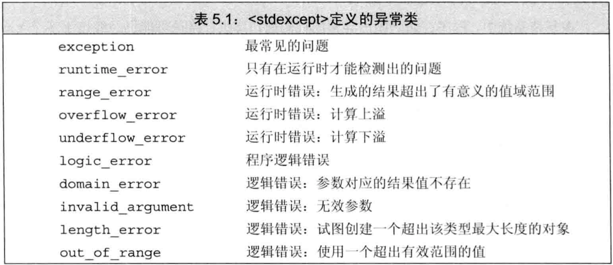

# C++ primer 第5章 语句

## 文章目录

[toc]

-   C++提供了一组`控制流`语句，包括`条件执行`语句、`循环`语句、`跳转`语句。

## 简单语句

-   一个`表达式`末尾加上分号就成了`表达式语句`。表达式语句的作用是：`执行表达式，丢弃求值结果`。语句中的表达式在求值时经常有其他效果，如赋值等。
-   最简单的语句是`空语句`，是一个单独分号`;`
-   多余的分号并不总是无害的，如if、for、while的括号后。
-   `复合语句`是用花括号`{}`括起来的语句和声明序列，也称为`块`。一个块是一个`作用域`。块中引入的名字只能在块内（包括嵌套于其中的块内）访问。
-   语法上需要一条语句，但逻辑上需要多条语句时使用语句块。如if、for、while的循环体
-   块结尾不需要分号。`空块`是指内部没有语句的一对花括号

## 语句作用域

-   可在if、switch、while、for的`控制结构内`定义变量，定义在控制结构中的变量只在相应的语句内部可见。由于这些变量马上要被使用，故必须初始化。

## 条件语句

-   C++提供了`if`和`switch`两种条件语句

### if语句

-   if语句作用：判断一个指定条件是否为真，根据结果决定是否执行另一条语句。

    ```cpp
    if (condition)
        statement
    else
        statement2
    ```

-   else分支可省略
-   if-else语句可嵌套
-   多个if或多个else时的匹配问题（悬垂else）：else总与它上面离他最近的尚未匹配的if匹配。

### switch语句

-   switch语句使我们可在若干固定选项中做选择

    ```cpp
    switch(statement){
        case value1:
            statement1
        case value2:
            statement2
        ...
    }
    ```

-   switch语句先对括号内表达式求值，表达式的值转为整型后与每个case标签的值比较。如匹配成功，则从匹配处开始顺序执行下面的所有case分支，除非显式中断。

-   为避免执行所有case分支，常用`break`中断switch语句。

-   case关键字及其对应值一起称为`case标签`，对应的值必须为整型常量表达式。同一个switch内不能存在相同的case标签。

-   `default`也是一种特殊的case标签，当没有一个case标签能匹配求值语句的值时执行default

-   例子：合并多个分支：

    ```cpp
    switch(ch){
        case 'a': case 'e': case 'i': case 'o': case 'u':
            ++vowelCnt;
            break;
    }
    ```

-   C++不允许跨过变量的初始化语句，直接跳转到其作用域的另一个位置。

-   例子：case分支中声明和定义变量

    ```cpp
    //程序的流程可能绕开初始化，故该switch语句不合法。
    case true:
        string file_name;       //错，控制流绕过隐式初始化的变量
        int ival=0;             //错，控制流绕过显式初始化的变量
        int jval;               //对，jval未初始化
        break;
    case false:
        jval=next_num();        //对，可给jval赋值。它在作用域内但未被初始化
        if (file_name.empty())  //file_name在作用域内，但未初始化
            ...
    ```

-   如果要为某case分支定义并初始化一个变量，应该把变量定义在块内，确保对其他case分支不可见

## 迭代语句

-   迭代语句通常称为`循环`。while和for在执行前检查条件，do-while在执行后检查条件。

### while语句

-   while语句重复执行循环体，直到条件不为真。

    ```cpp
    while(condition)
        statement
    ```

-   while的条件部分可以是表达式或是带初始化的变量声明，在条件中或循环体内定义的变量在每次迭代都要重新创建到销毁。

### 传统的for语句

```cpp
for(init-statement; condition; expression)
    statement
```

-   init-statement必须是声明语句、表达式语句、空语句中的一种，它只在循环开始时执行一次，不会重复执行。
-   init-statement可定义多个变量，但只能有一条声明语句，故它们基础类型必须相同。
-   expression在每次迭代之后执行。
-   for语句头可省略init-statement、condition、expression中的一个或全部，但分号不可省略。省略condition相当于用`true`代替。
-   for语句头中定义的名字只在语句头和循环体内可见

### 范围for语句

```cpp
for(declaration: expression)
    statement
```

-   expression必须是`序列`，如：花括号的初值列表、数组、vector或string等的对象（这些对象都能由begin和end返回迭代器）

-   declaration定义一个变量用于访问元素，为确保类型相容经常用auto。如要修改元素，必须声明为`引用`

-   每次迭代时都会重新定义循环变量，然后再执行statement

-   范围for的定义来源于与之等价的传统for，因此不能在范围for中修改序列的大小（会使迭代器无效）。

-   例子：范围for和传统for

    ```cpp
    vector<int> v={0,1,2,3,4,5,6,7,8,9};
    //范围for
    for(auto &r:v)
        r*=2;
    //对应的传统for
    for(auto beg=v.begin(), end=v.end(); beg!=end; ++beg){
        auto &r=*beg;
        r*=2;
    }
    ```

### do-while语句

```cpp
do
    statement
while(condition);
```

-   do-while每次先执行循环体再检查条件。循环体至少执行一次
-   该语句最后有分号标志结束
-   condition不能为空
-   condition使用的变量必须定义在循环体外
-   condition中不能定义变量，否则第一次在循环体中使用时未定义。

## 跳转语句

-   用于中断当前的执行过程，包括4种：`break`、`continue`、`goto`、`return`

### break语句

-   break终止离它最近的while、do-while、for、switch，从它们之后的第一条开始执行。break只能出现在循环或switch内

### continue语句

-   continue终止最近循环中的当前一次迭代，并开始下一次迭代。只能出现在for、while、do-while内

### goto语句

-   goto无条件跳转到同一函数内的另一条语句
-   goto的目标是`带标签语句`，它是在语句前加一个标签标示符和冒号。由于标签标示符独立于变量或其他标示符的名字，故标签标示符可与其他变量同名，不会干扰
-   goto不能用于从变量作用域外跳到作用域内（越过声明语句执行），因为未声明。
-   goto可以跳转到已定义的对象的定义之前，这意味着该变量将被销毁并重新创建。

## try语句块和异常处理

-   `异常`：运行时的反常行为，超出了函数正常功能的范畴
-   异常处理机制包括：`异常检测`和`异常处理`
-   异常检测部分使用`throw表达式`表示遇到异常。一般说throw`引发（raise）`了异常
-   异常处理部分使用`try语句块`来处理。try语句块以try开始，以一个或多个`catch子句`结束。try语句块中抛出的异常将被某个catch子句处理。
-   C++定义了一套`异常类`，用于在throw表达式和相关catch子句间传递异常的具体信息。

### throw表达式

-   throw表达式包含throw关键字和紧随其后的一个表达式，如`throw statement`，表达式的类型是抛出异常的类型。
-   类型`runtime_error`是异常类的一种，定义于`stdexcept头文件`中。runtime_error必须由一个string对象或C风格字符串来初始化。

### try语句块

```cpp
try{
    program-statements
}
catch(exception-declaration){
    handler-statements
}
catch(exception-declaration){
    handler-statements
}
...
```

-   catch子句括号中是`异常声明`，按照某种异常类型声明该类型的变量，捕获到该类型异常时，为该变量赋值。
-   try中是可能抛出异常的程序，抛出异常后与各catch子句捕获异常的类型对比，并执行匹配的catch子句。
-   try语句块中声明的变量在块外无法访问，即使是catch中也不行。
-   例子：抛出并处理异常

```cpp
while(cin>>item1>>item2){
    try{
        if(item1.isbn() != item2.isbn())
            throw runtime_error("Data must refer to same ISBN"); //抛出runtime_error类型异常
        cout<<item1+item2<<endl;
    }
    catch(runtime_error err){   //捕获runtime_error类型异常，存储到变量err中
        cout<<err.what()        //what成员函数得到抛出异常时的信息
            <<"\nTry Again? Enter y or n"
            <<endl;
        char c;
        cin>>c;
        if(!cin || c=='n')
            break;
    }
}
```

-   如果有嵌套的异常处理，即try中可能调用了包含另一个try语句块的函数，则捕获异常顺序与函数调用顺序相反，沿着执行路径回退来找适合的catch
-   如果抛出了异常，且不存在匹配的catch，则程序调用标准库函数`terminate`，该函数使程序非正常退出，其具体行为与系统有关。
-   在异常发生期间能正确执行“清理”工作的程序称为`异常安全`的代码。编写异常安全的代码非常困难，必须清楚异常何时发生，发生后程序如何确保对象有效、资源无泄露、程序处于合理状态，等

### 标准异常

-   C++定义了一组`异常类`，定义在4个头文件中

    -   `exception头文件`定义最通用的异常类`exception`，它只报告异常的发生，不提供任何信息
    -   `stdexcept头文件`定义了几种常见异常类，见表5.1
    -   `new头文件`定义了异常类`bad_alloc`
    -   `type_info头文件`定义了异常类`bad_cast` 

-   标准库异常类只定义了几种运算：创建、拷贝、赋值。

-   对exception、bad_alloc、bad_cast只能使用默认初始化，不可提供初始值。其他异常类相反，不可默认初始化，必须提供string对象或C风格字符串做初值。

-   每个异常类定义了`what方法`，该方法没有参数，返回值是指向C风格字符串的`const char *`，该字符串提供异常相关的文本。若该异常类型有字符串初始值，则what返回该字符串，若无初始值，则what返回值由编译器决定。