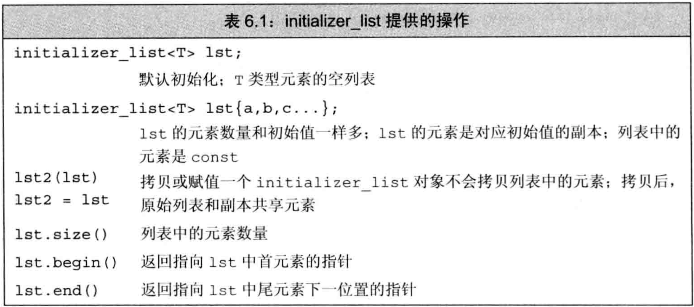

# C++ primer 第6章 函数

## 文章目录

[toc]

-   `函数`是一个命名了的代码块，通过`调用`函数来执行相应代码。
-   函数可有0个或多个参数，可能产生0个或1个结果。
-   函数可以`重载`，即一个名字对应多个不同函数。

## 函数基础

-   `函数定义`包括：`返回类型`、`函数名字`、由0个或多个形参组成的`形参列表`、`函数体`

-   通过`调用运算符()`来执行函数，它作用于一个表达式，该表达式是函数或函数指针。圆括号内是一个逗号隔开的实参列表，调用时用实参初始化形参。

-   调用运算符作用于函数，就是一个`调用表达式`。调用表达式的类型是函数的返回类型

-   函数的`调用`完成两项工作:

    -   隐式定义形参并用实参初始化函数对应的形参
    -   将控制权从`主调函数`转移给`被调函数`

-   `return语句`完成两项工作:
-   返回return语句中的值（如果有），将其作为调用表达式的结果
    -   将控制权从`被调函数`转移回`主调函数`
    
-   实参是形参的初始值，它们一一对应，实参与形参类型需匹配或能转换。但`调用运算符并未规定实参的求值顺序`。

-   为与C兼容，可用`void关键字`表示函数没有形参。

-   每个形参是含有一个声名符的声明。但即使两个形参类型一样，也必须都写出类型，不可省略。

-   函数最外层作用域的局部变量不能与形参同名。

-   形参名是可选的，不会被用到的形参不需命名，但需提供实参。

-   函数返回类型不可以是数组或函数类型，但可以是指向数组或函数的指针。

### 局部对象

-   名字的`作用域`是程序文本的一部分，名字在其中可见。

-   对象的`生命周期`是程序执行过程中该对象存在的一段时间。

-   形参和函数体内定义的局部变量统称为`局部变量`，它们仅在函数体内可见。

-   所有函数之外定义的对象存在于函数的整个执行过程中，此类对象在程序启动时创建，程序结束才被销毁。

-   `自动对象`：只存在于块执行期间的对象

-   形参是一种自动对象，函数开始时创建，函数终止时销毁

-   若局部变量对应的自动对象定义时有初始值，则用初始值初始化，若无初始值则`默认初始化`。即，`内置类型的未初始化局部变量产生未定义的值`。

-   `局部静态对象`：将局部变量定义成`static类型`，在程序执行第一次经过定义语句时初始化，直到程序终止才被销毁。

-   若局部静态对象没有显式初始值，将执行`值初始化`。即，`内置类型的局部静态变量被初始化为0`

-   例子：局部静态对象

    ```cpp
    size_t count_calls(){
        static size_t ctr=0;    //调用结束后不会销毁
        return ++ctr;           //每次调用时+1，该变量表示该函数被调用的次数
    }
    int main(){
        for(size_t i=0; i!=10; ++i)
            cout<<count_calls()<<endl;
        return 0;
    }
    ```

### 函数声明

-   函数的名字必须在使用前声明。函数只能定义一次，但可声明多次。如果一个函数不会被使用，则可只声明不定义。
-   函数声明又叫`函数原型`，函数声明的三要素（返回类型、函数名、形参类型）描述了函数的接口。
-   函数声明不需函数体，用分号代替函数体。由于不使用形参，故声明中形参可不命名。
-   建议函数在`头文件`中声明，在`源文件`中定义。和变量一样。

### 分离式编译

-   C++支持分离式编译，即允许将程序分割到几个文件中，每个文件单独编译。

-   每个文件单独编译时产生后缀名为`.obj`(windows)或`.o`(UNIX)的文件，含义是该文件中包含`对象`代码

-   单独编译后`链接器`将`对象文件`链接起来成为`可执行文件`

    ```bash
    $ CC -c factMain.cc             #产生factMain.o
    $ CC -c fact.cc                 #产生fact.o
    $ CC factMain.o fact.o -o main  #将两个对象文件链接为可执行文件
    ```

## 参数传递

-   每次调用函数时都会重新创建形参并用实参初始化
-   如果形参是`引用`类型，将被`绑定`到对应实参。否则，将实参的值`拷贝`给形参。
-   两种传参：
    -   `引用传递`：形参是引用类型，引用形参绑定到对应实参的对象，是实参的别名。说这样的实参被`引用传递`，或者说函数被`传引用调用`。
    -   `值传递`：实参的值被拷贝给形参，形参和实参是两个独立的对象。说这样的实参被`值传递`，或者说函数被`传值调用`

### 传值参数

-   初始化一个非引用类型的变量时，初始值被拷贝给变量。此时对变量的改变不会影响初始值。
-   当指针被拷贝后，两个指针是不同的指针，但指向相同的对象。通过任一个指针修改时，对象都被改变了。
-   C程序员常用指针类型形参修改函数外的对象，但在C++中，建议用引用类型形参代替指针

### 传引用参数

-   对于引用的操作实际上是作用在引用绑定的对象上
-   通过引用传参，允许函数改变实参的值
-   使用引用传参的情形：
    -   拷贝`大的类类型对象`或`容器对象`效率较低，最好用引用形参访问
    -   `有的类型不支持拷贝`（如IO类），只能用引用传参访问
    -   引用传参为函数`一次返回多个结果`提供了途径，只需将多个对象作为引用传进函数即可修改。
    -   无需修改引用形参时，最好用`常量引用`

### const形参和实参

-   当形参是const时，要注意关于`顶层const`有关的讨论：实参初始化形参时会忽略顶层const。即，当形参有顶层const时，传const对象或非const对象都可以

-   例子：形参是顶层const

    ```cpp
    //下面两个函数可接受相同参数，故是相同函数，不可重载
    void fcn(const int i){}
    void fcn(int i){} //错，重复定义
    ```

-   可以用非常量初始化底层const，反之不可
-   C++允许用字面值初始化常量引用
-   使用非常量引用会极大限制函数能接受的实参类型：不能把const对象、字面值、需要类型转换的对象传递给非常量引用形参

### 数组形参

-   由于`不能拷贝数组`，故不能以值传递方式传入数组

-   由于`数组会被转为指针`，故向函数传入数组时，实际上是传指针。（所以函数内不能用`sizeof`等得到数组大小）

-   形参数组的大小对函数没有影响，函数也不知道实参数组的尺寸

-   例子：数组作为形参

    ```cpp
    //以下3个函数等价，形参类型都是const int *
    void print(const int *);
    void print(const int []);
    void print(const int [10]); //数组大小传入时被丢弃
    ```

-   3种传入数组时界定范围的方法：
    -   要求数组本身有`结束标记`，如C风格字符串
    -   传入`一对迭代器`（首指针和尾后指针），可由begin和end函数得到，类似标准库操作
    -   定义一个表示`数组大小`的形参
    
-   例子：对数组界定范围

    ```cpp
    void print(const char *cp){}                    //C风格字符串
    void print(const int *beg, const int *end){}    //一对迭代器
    void print(const int ia[], size_t size){}       //传入大小
    ```

-   若函数不需要写数组元素，则数组形参应是指向const的指针

-   形参可以是`数组的引用`，此时引用形参绑定到对应数组，此时避免数组被转为指针，给实参时大小也需与形参大小相等。

-   例子：形参是数组的引用，数组不转指针

    ```cpp
    void print(int (&arr)[10]){ //形参是数组的引用，数组不转指针，实参大小也必须符合
        for(auto elem:arr)
            cout<<elem<<endl;
    }
    ```

-   传递`多维数组`时，多维数组的首元素本身就是数组，因此首元素指针就是指向数组的指针。传入函数时，首元素指针指向的对象仍是数组，因此数组的第二维以及其后所有维度的大小都是数组类型的一部分，不能省略。

-   例子：传入多维数组时，只有第一维被转指针

    ```cpp
    //以下两定义等价
    void print(int (*matrix)[10], int rowSize){}    //指针形式传入二维数组
    void print(int matrix[][10], int rowSize){}     //数组形式传入二维数组
    ```

### main：处理命令行选项

-   可以给main传递实参，在命令行运行程序时传递给main函数

    ```cpp
    //main的两种定义方式
    int main(int argc, char *argv[]){}
    int main(int argc, char **argv){}
    ```

-   `argv`是一个数组，其元素是指向C风格字符串的指针。`argc`表示数组长度

-   例子：命令行向main传参

    ```bash
    $ prog -d -o ofile data  # argc=5, argv={"prog","-d","-o","ofile","data"}
    ```

### 含有可变形参的函数

-   有时候无法预知函数会被传入多少个实参，此时用`可变形参`

-   可变形参3种选择：
    -   若实参类型相同，使用`initializer_list`标准库类型的对象
    -   若实参类型不同，使用`可变参数模板`
    -   用于与C的接口时，可用`省略符...`
    
-   `initializer_list`是一种标准库类型，是模板，用于表示某种特定类型的值的数组，定义在`initializer_list头文件`中 

-   initializer_list对象中的元素永远是常量，因为传入参数不可改变。

-   向initializer_list形参中传递一个值的序列，必须把序列放在花括号`{}`中。实际上，`列表初始化vector等容器`也是用了形参为initializer_list的`拷贝构造函数`

-   initializer_list包含begin和end方法

-   例子：initializer_list

    ```cpp
    void error_msg(ErrCode e, initializer_list<srting> il){     //定义传入initializer_list的函数
        cout<<e.msg()<<": ";
        for(const auto &elem:il)
            cout<<elem<<" ";
        cout<<endl;
    }
    string expected, actual;
    if(expected!=actual)
        error_msg(ErrCode(42), {"functionX",expected,actual});  //向initializer_list传参
    else
        error_msg(ErrCode(0), {"functionX","OK"});              //向initializer_list传参
    ```

-   省略符形参是为便于C++访问某些特殊C代码设计的，这些代码使用了`varargs`的C标准库功能。
-   省略符形参只能用于C和C++通用的类型，大多数类类型对象通过它传参时无法正确拷贝
-   省略符形参只能出现在形参列表的最后，省略符形参对应的实参无需类型检查

## 返回类型和return语句

-   return语句终止当前正在执行的函数，并将控制权返回到调用该函数的地方

### 无返回值函数

-   无返回值的return语句只能用在返回类型是`void`的函数中，这样的函数不一定需要显式的return，它们最后一行后面会隐式执行return。
-   如果想在返回void的函数中间退出，可用return
-   返回类型是void的函数也可用`return expression`形式，只是`expression`必须是另一个返回void的函数，否则报错。

### 有返回值的函数

-   只要函数返回类型不是void，则函数内的每个return都必须返回值。return返回的类型必须与函数返回类型相同，或能隐式转换为函数返回类型

-   有返回值的函数必须通过显式的return返回，最后不存在隐式的return。未通过显式return返回是未定义行为。

-   函数返回值的方式和初始化变量、形参一样：返回的值用于初始化调用点的一个`临时量`，该临时量是`调用表达式`的结果

-   若返回值非引用，则被拷贝到调用点。若返回值是引用，则它仅是它所引对象的别名。

-   `不可返回局部对象的引用或指针`：函数终止意味着局部变量的引用将指向不再有效的内存区域。

-   调用运算符`()`的优先级与点运算符`.`和箭头运算符`->`相同，且满足`左结合律`。因此，如果函数返回类类型对象或其引用，就可在调用表达式后直接取成员

-   例子：调用返回类对象，立即取成员

    ```cpp
    auto sz=shorterString(s1,s2).size(); //调用shorterString返回string对象，可立即取成员
    ```

-   返回引用的函数被调用后得到`左值`，其他类似得到`右值`。故可为返回非常量引用的调用表达式赋值

-   例子：返回引用的函数被调用后得到左值

    ```cpp
    char &get_val(string &str, string::size_type ix){   //返回char的引用
        return str[ix];                                 //假定索引有效，不做检查
    }
    int main(){
        string s("a value");
        cout<<s<<endl;
        get_val(s,0)='A';                               //函数调用返回左值，可赋值
        cout<<s<<endl;
        return 0;
    }
    ```

-   函数可返回花括号包围的值的列表，这表示对返回的临时量做`列表初始化`。若列表为空，临时量被`值初始化`。若返回类类型，由类本身定义初始化行为。

-   例子：用返回列表做列表初始化

    ```cpp
    vector<string> process(){
        if(expected.empty())        return {};                              //返回vector被值初始化
        else if(expected==actual)   return {"functionX","OK"};              //返回vector被列表初始化
        else                        return {"functionX",expected,actual};   //返回vector被列表初始化
    }
    ```

-   允许main函数没有return语句直接结束，相当于最后隐式执行`return 0;`，返回0表示成功，其他值表示失败
-   `cstdlib头文件`中定义了两个`预处理变量`分别表示成功与失败：`EXIT_SUCCESS`（成功）和`EXIT_FAILURE`（失败）
-   `递归`函数：一个函数调用了它自身
-   递归函数中必有某条路径不包含递归调用，否则函数永远不会终止
-   main不可递归调用

### 返回数组指针

-   数组不能拷贝，故函数不能返回数组，但可返回数组的指针或引用

-   例子：用类型别名简化返回数组

    ```cpp
    typedef int arrT[10];   //arrT等价于长度为10的整型数组，不会转指针
    using arrT=int[10];     //等价于上一行，arrT等价于长度为10的整型数组，不会转指针
    arrT *func(int i);      //函数返回指向arrT的指针
    ```

-   若不使用类型别名，就必须记得将数组维度带上。要定义一个`返回数组指针的函数`，则返回数组的维度必须放在形参列表之后。形如：`type (*function(parameter_list))[dimension]`。读法：function是形参列表为parameter_list的函数，它返回一个指针，该指针指向大小为dimension的数组，元素类型是type

-   `尾置返回类型`：为简化复杂返回类型的定义，任何函数的定义都可用尾置返回。尾置返回类型放在形参列表后，并以`->`开头，代替原来返回类型的地方使用`auto`。尾置返回常用于返回数组指针或引用的函数

-   例子：尾置返回类型

    ```cpp
    auto func(int i) -> int(*)[10]; //尾置返回声明，函数返回一个指针，该指针指向大小为10的int数组
    int (*func(int i))[10];         //等价于上一行，是它对应的普通声明
    ```

-   如果知道函数返回的指针指向哪个数组，就可用`decltype`声明返回类型。decltype作用于数组时不会转指针，故指针符号需手动加上

-   例子：用decltype声明返回数组指针

    ```cpp
    int odd[]={1,3,5,7,9};
    int even[]={0,2,4,6,8};
    decltype(odd) *arrPtr(int i){ //推导返回类型为数组指针
        return (i%2)?(&odd):(&even);
    }
    ```

## 函数重载

-   `重载函数`：同一作用域内几个函数名字相同但形参列表不同。即应该在形参的`数量`或`类型`上有所区分（仅返回类型不同不叫重载）。

-   调用重载函数时，编译器根据实参类型推断出想要的是哪个函数

-   main函数不可重载

-   顶层const不影响传入函数的对象，顶层const的形参无法和顶层非const的形参区分，因此`顶层const不可重载`

-   若形参是指针或引用，则通过区分指向对象是否是const可实现重载，即`底层const可以重载`

-   例子：顶层const不可重载，底层const可以重载

    ```cpp
    Record lookup(Phone);
    Record lookup(const Phone);     //顶层const，不可重载，重复声明
    Record lookup(Phone *);
    Record lookup(Phone * const);   //顶层const，不可重载，重复声明
    Record lookup(Account &);
    Record lookup(const Account &); //底层const，可以重载
    Record lookup(Account *);
    Record lookup(const Account *); //底层const，可以重载
    ```

-   编译器可通过实参底层是否是const判断该调用哪个函数。

-   const对象/指向const的指针只能传递给底层const形参

-   非const对象/指向非const的指针可以传递给底层const形参或底层非const形参，但编译器优先选择底层非const版本

-   `const_cast`在重载函数的情形中很有用，它可以修改指针或引用的底层const权限。若一个引用/指针指向了`非常量对象`，而该引用/指针却被声明为常量引用/指向常量的指针，则不可通过此引用/指针来修改对象，除非用const_cast将此引用/指针的底层const资格去掉。

-   const_cast只可在`底层本来为非常量对象`时，才能去掉引用/指针的底层const

-   例子：const_cast修改引用/指针的底层const

    ```cpp
    //返回两字符串的较短者，输入输出都是常量引用
    const string &shorterString(const string &s1, const string &s2){
        return (s1.size()<=s2.size()>)?(s1):(s2);
    }
    //上一个函数的重载，输入输出都是非常量引用的版本
    string &shorterString(string &s1, string &s2){                  //输入对象本来是非常量
        auto &r=shorterString(  const_cast<const string &>(s1),
                                const_cast<const string &>(s2));    //修改引用权限，使引用为底层const
        return const_cast<string &>(r);                             //底层对象实际仍为非常量，只是引用是底层const，此时可用const_cast修改引用权限
    }
    ```

-   `函数匹配`又叫`重载确定`，编译器首先将调用的实参与重载集合中每一个函数的形参比较，再根据比较结果决定调用哪个函数
-   调用重载函数时可能有3种结果：
    -   找到`最佳匹配`的函数
    -   找不到任何函数与实参匹配，`无匹配`错误
    -   匹配到多于一个函数，但每一个都不是最佳，`二义性调用`错误

### 重载与作用域

-   将函数声明放在局部作用域内不太好
-   一旦在内层作用域中找到所需名字，编译器将忽略外层作用域中的同名实体
-   在不同作用域中不可重载函数名，作用域相同才能重载
-   C++中，`名字查找发生在类型检查之前`

## 特殊用途语言特性

### 默认实参

-   `默认实参`：函数调用时可以不指定对应的形参，此时该形参被初始化为默认实参。

-   带有默认实参的形参，既可接受默认实参，也可在调用时被赋予指定值

-   `默认实参只能在形参列表最后`：函数调用时实参按照位置解析，默认实参负责填补函数调用缺少的尾部实参

-   设计含有默认实参的函数时，需要合理安排形参顺序

-   多次声明同一个函数合法，但同一作用域中一个形参只可被赋予一次默认实参。即，函数的其他声明只能为前面声明中没有默认实参的形参添加默认实参，且该形参右侧的所有形参都必须有默认值

-   例子：重复声明函数与默认实参

    ```cpp
    string screen(sz, sz, char=' ');    //第一条声明
    string screen(sz, sz, char='*');    //错，重复声明
    string screen(sz=24, sz=80, char);  //对，添加默认实参
    ```

-   函数内的局部变量不可作为默认实参

-   用作默认实参的名字在函数`声明`所在的作用域中解析，但求值过程发生在函数`调用`时

-   例子：默认实参的名字在声明作用域中解析，但求值发生在调用时

    ```cpp
    sz wd=80;
    char def=' ';
    sz ht();
    string screen(sz=ht(), sz=wd, char=def); //声明函数，带有默认实参
    string window=screen(); //screen(ht(),80,' ')
    void f2(){
        def='*';            //def变量仍是外部的
        sz wd=100;          //内部重新定义了wd变量
        window=screen();    //默认实参的名字在外部解析，故为screen(ht(),80,'*')
    }
    ```

### 内联函数和constexpr函数

-   调用函数比求等价的表达式更慢，因为运行函数有开销

-   `内联函数`：将函数在每个调用点处内联地展开（类似宏定义），避免运行时开销。形式是在函数返回类型前加`inline关键字`

-   内联说明只是向编译器发出的请求，编译器可将其忽略

-   内联适合用规模小、流程直接、调用频繁的函数。很多编译器不支持内联递归函数

-   `constexpr函数`：能用于常量表达式的函数，其返回类型及所有形参类型都是字面值类型，且函数体有且仅有一条return语句

-   `constexpr函数`应在编译期就可确定结果，其返回值是`常量表达式`，故可给`constexpr类型`变量赋值。

-   为在编译期随时展开，`constexpr函数一定是内联的`

-   允许constexpr的返回值是非常量，只要保证输入常量表达式时能输出常量表达式（即编译期求值）即可。

-   例子：constexpr函数返回值非常量

    ```cpp
    constexpr int new_sz() {return 42;}                         //返回常量表达式
    constexpr size_t scale(size_t cnt) {return new_sz()*cnt;}   //形参非常量，返回值非常量
    int arr[scale(2)];  //对，scale输入常量表达式时输出即是常量表达式
    int i=2;
    int a2[scale(i)];   //错，scale输入不是常量表达式，输出也不是常量表达式
    ```

-   普通函数只可多次声明不可多次定义（不要把普通函数的定义放在头文件中），但内联函数和constexpr函数可多次定义，只需保证多个定义相同。因为调用这些函数只是内联展开
-   内联函数和constexpr函数应定义于头文件中，因为内联函数在编译时（链接前）就要展开，故它的定义必须对编译器可见

### 调试帮助

-   程序可包含一些用于调试的代码，只在开发时使用，发布时需屏蔽掉调试代码。

-   编写调试代码经常用两项预处理功能：`assert`和`NDEBUG`

-   `assert`是一个`预处理宏`，本质也是一个预处理变量，行为类似内联函数，定义在`cassert头文件`中，常用于检查不应该发生的条件。

-   assert宏用表达式作为条件，形如`assert(expr)`。对`expr`求值，若为`true`则什么也不做，若为`false`则输出信息并终止程序

-   预处理名字由`预处理器`而非编译器管理，不在std命名空间中。它们在程序内必须唯一。

-   assert宏的行为依赖于`预处理变量NDEBUG`，若定义了NDEBUG，则assert宏什么也不做。

-   默认状态下NDEBUG未被定义，可用`#define NDEBUG`来定义它，从而关闭调试状态，不执行assert检查

-   亦可在`编译选项`中指定预处理变量

    ```bash
    $ CC -D NDEBUG main.cc  #定义预处理变量NDEBUG。在VC中用/D
    ```

-   assert可当作调试手段，但不可代替真正的运行时逻辑检查、错误检查等。

-   可用NDEBUG编写自己的条件测试代码，类似于`头文件保护`

-   例子：使用NDEBUG控制可见代码段

    ```cpp
    void print(const int ia[], size_t size){
    #ifndef NDEBUG  //只有调试状态才执行中间的代码
        cerr<<__func__<<": array size is "<<size<<endl;
    #endif
    //...
    }
    ```

-   `__func__`：编译器为每个函数定义了该变量，它是`const char`的静态数组，存放函数的名字
-   预处理器定义了另外几个对调试有用的名字：
    -   `__FILE__`存放文件名的字符串字面值
    -   `__LINE__`存放当前行号的整型字面值
    -   `__TIME__`存放文件编译时间的字符串字面值
    -   `__DATE__`存放文件编译日期的字符串字面值

## 函数匹配

-   当几个重载的函数形参数量相等且某些形参类型可转化时，函数匹配比较困难

-   `第一步`：按名字筛选。要求：1、与被调用函数同名；2、在调用点可见。这些函数称为`候选函数`

-   `第二步`：按实参筛选。要求：1、形参与实参数量匹配；2、形参与实参类型匹配，或实参能转换为形参。这些函数称为`可行函数`，如果没有可行函数，编译器报错：`无匹配函数`

-   `第三步`：选择最匹配。实参与形参类型越接近则匹配得越好，精确匹配比需要类型转换的匹配更好。

-   选择最匹配时，如果有且仅有一个函数满足以下条件，则匹配成功，否则编译器报错：`二义性调用`：
    -   该函数每个实参的匹配都不劣于其他可行函数
    -   该函数至少有一个实参的匹配优于其他可行函数

-   例子：函数匹配

    ```cpp
    void f();
    void f(int);
    void f(int,int);
    void f(double,double=3.14);
    f(5.6)      //(double,double)精确匹配
    f(42,2.56)  //第一个实参与(int,int)匹配更好，第二个实参与(double,double=3.14)匹配更好，二义性调用
    ```

-   调用重载函数时尽量避免强制转换。设计良好的系统中不应对实参做强制转换

### 实参类型转换

-   为确定最佳匹配，编译器将实参到形参的类型转换分为几个等级：
    -   精确匹配，包括：类型相同、数组转指针、函数转指针、改变顶层const
    -   通过const转换实现的匹配
    -   通过类型提升实现的匹配
    -   通过算术转换或指针转换实现的匹配
    -   通过类类型转换实现的匹配
    
-   即使是很小的整型也会直接被提升为int

-   所有算术转换的级别一样，double转float并不比double转int更好。

-   非常量对象初始化常量引用需要类型转换

-   例子：实参类型转换

    ```cpp
    //整型提升
    void ff(int);
    void ff(short);
    ff('a');        //char提升为int，调用(int)
    //算术转换
    void manip(long);
    void manip(float);
    manip(3.14);    //浮点字面值是double，转换到long和float代价一样，二义性调用
    //const转换
    Record lookup(Account &);
    Record lookup(const Account &);
    const Account a;
    Account b;
    lookup(a);      //底层const只能与底层const匹配，调用(const Account &)
    lookup(b);      //底层非const优先与底层非const匹配，调用(Account &)
    ```

## 函数指针

-   `函数指针`指向的是函数而非对象。`函数不是对象`

-   `函数的类型`由其返回值类型和形参类型共同决定，与函数名和形参名无关。

-   把函数名作为值使用时，函数自动转为指针

-   可使用函数指针调用函数，此时写不写解引用`*`无所谓

-   例子：函数类型和函数指针

    ```cpp
    bool lengthCompare(const string &, const string &); //类型是：bool(const string &, const string &)
    bool (*pf)(const string &, const string &);         //声明对应类型的函数指针，未初始化
    pf=&lengthCompare;              //初始化函数指针
    pf=lengthCompare;               //等价于上一句。因为函数名转为指针，故取地址符是可选的
    //下面3条语句互相等价
    bool b1=pf("hello","goodbye");  //解引用符是可选的
    bool b2=(*pf)("hello","goodbye");
    bool b3=lengthCompare("hello","goodbye");
    ```

-   指向不同函数类型的指针间不存在转换规则

-   可以将函数指针赋值为nullptr或0的常量表达式，表示不指向任何函数

-   若定义了指向重载函数的指针，则指针类型必须与某一函数`精确匹配`

-   例子：指向重载函数的指针必须精确匹配

    ```cpp
    void ff(int *);
    void ff(unsigned int);
    void (*pf1)(unsigned int)=ff;   //精确匹配到ff(unsigned int)
    void (*pf2)(int)=ff;            //错，无精确匹配
    void (*pf3)(int *)=ff;          //错，无精确匹配
    ```

-   不能定义函数类型的形参，但形参可以是指向函数的指针。此时看起来像函数，实际上是指针。`形参中的函数会被自动转为指针`

-   可用`类型别名`和`decltype`简化函数/函数指针作为形参的函数原型，对函数做decltype时不会被转指针

-   例子：形参是函数指针

    ```cpp
    //类型是：bool(const string &, const string &)
    bool lengthCompare(const string &, const string &);
    //以下两行等价，形参中的函数类型会自动转为指针
    void useBigger( const string &s1, const string &s2, 
                    bool pf(const string &, const string &));
    void useBigger( const string &s1, const string &s2, 
                    bool (*pf)(const string &, const string &));
    //以下两行等价，Func是函数类型
    typedef bool Func(const string &, const string &);
    typedef decltype(lengthCompare) Func;
    //以下两行等价，FuncP是函数指针类型
    typedef bool (*FuncP)(const string &, const string &);
    typedef decltype(lengthCompare) *FuncP;
    //以下两行等价，形参中的函数类型会自动转为指针
    void useBigger(const string &s1, const string &s2, Func);
    void useBigger(const string &s1, const string &s2, FuncP);
    ```

-   不能将函数作为返回值，但能将函数指针作为返回值

-   函数指针作为返回值时，必须明确写成指针。`返回值中的函数类型不会被自动转为指针`

-   可用`类型别名`和`尾置返回类型`简化函数指针作为返回值的函数原型

-   例子：返回类型是函数指针

    ```cpp
    using F=int(int*,int);              //是函数类型
    using PF=int(*)(int*,int);          //是函数指针类型
    int (*f1(int))(int*,int);           //直接声明
    PF f1(int);                         //返回指向函数的指针，等价于上一行
    F *f1(int);                         //返回指向函数的指针，等价于上一行
    F f1(int);                          //错，不能返回函数
    auto f1(int) -> int(*)(int*,int);   //等价于原声明
    ```

-   auto和decltype也可用于返回函数指针的原型

-   例子：decltype用于返回函数指针

    ```cpp
    string::size_type sumLength(const string &, const string &);
    string::size_type largerLength(const string &, const string &);
    decltype(sumLength) *getFcn(const string &); //返回指向上面两函数之一的指针
    ```

    
