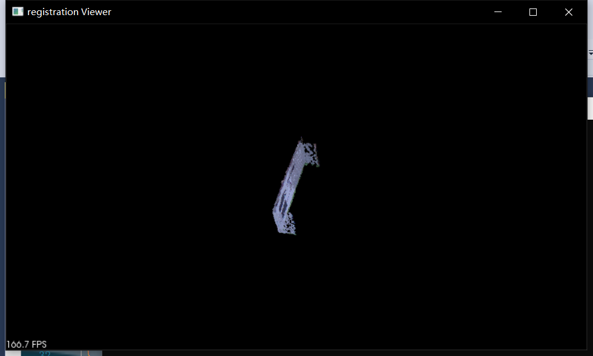

# 点云数据处理

## 点云提取

根据采集出来的点云数据进行提取目标，具体步骤为

1. 采用[基于PCL的屏幕选点、框选点云、单点选取](https://www.cnblogs.com/flyinggod/p/9487959.html)程序取得目标在PCL坐标系中的坐标。
 	2. 采用直通滤波对采集出的点云进行处理，提取目标。
 	3. 采用统计滤波滤除离群点。

==PS：对点云数据还可以采取双边滤波，目前没有实现，接下来进行测试双边滤波后效果。==

## 点云配准

对两个提取出来的目标用手动ICP方法进行配准，配准100次以后基本成型，然后将两个点云拼接融合。

配准效果：

配准前1

配准前2

配准

配准后1

配准后2
